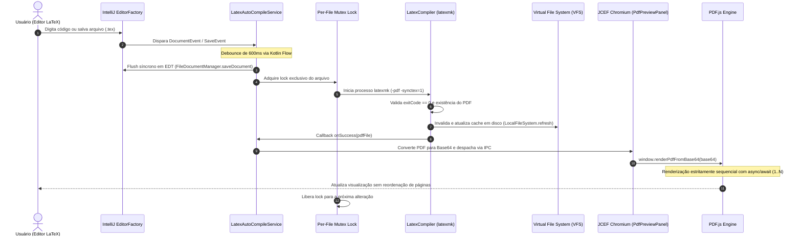

<div align="center">

# LaTeX Compile & Preview — IntelliJ Platform Plugin

**Plugin de Alta Performance para Autoria, Compilação Reativa e Visualização PDF em Tempo Real na Plataforma IntelliJ**

[](https://github.com/joelmaykon94/plugin-intellij-latex-compile/actions/workflows/build-and-release.yml)
[](https://github.com/joelmaykon94/plugin-intellij-latex-compile/releases)
[](https://plugins.jetbrains.com/)
[](https://openjdk.org/projects/jdk/21/)
[](https://kotlinlang.org/)
[](https://gradle.org/)
[](LICENSE)

**Split Editor Nativo · Pipeline de Compilação Reativo com Mutex · Renderizador PDF.js via JCEF · SyncTeX & Scroll Sync · Zoom Avançado · Download de PDF**

[Visão Geral](#-por-que-o-latex-compile--preview) · [Instalação e Uso](#-instalação-e-guia-rápido) · [Arquitetura e Engenharia](#-arquitetura-do-plugin) · [Recursos Detalhados](#-engenharia-e-recursos-internos) · [Troubleshooting](#-diagnóstico-e-resolução-de-problemas) · [Stack](#-stack-tecnológica)

</div>

---

## 📌 Por que o LaTeX Compile & Preview?

O fluxo tradicional de escrita acadêmica e técnica em LaTeX frequentemente sofre de atrito operacional: alternância constante de janelas entre o editor de código e visualizadores PDF externos (Evince, Okular, Acrobat), scripts de compilação manuais e conflitos de concorrência que corrompem arquivos auxiliares (`.aux`, `.fls`, `.synctex.gz`).

O **LaTeX Compile & Preview** transforma IDEs baseadas na plataforma IntelliJ (IntelliJ IDEA Ultimate/Community, PyCharm, CLion, WebStorm, etc.) em uma estação de trabalho LaTeX profissional e autossuficiente:

* **Zero Troca de Janelas:** Painel dividido lado a lado (*Split View*) com código-fonte à esquerda e renderização PDF à direita.
* **Auto-Compilação Reativa:** Captura instantânea de digitação e salvamentos com *debounce* inteligente e exclusão mútua por arquivo, prevenindo colisões de processos no `latexmk`.
* **Renderização Determinística:** Mecanismo JCEF (Chromium) + PDF.js moderno com garantia estrita de ordenação de páginas (evitando deslocamento de referências e apêndices) e tratamento robusto de concorrência via IDs de renderização.
* **Busca Reversa (SyncTeX):** Salto bidirecional do PDF diretamente para a linha do código-fonte com duplo clique.
* **Soberania e Privacidade:** Processamento 100% local, sem telemetria, sem envio de manuscritos para serviços externos em nuvem.

---

## 🚀 Instalação e Guia Rápido

O plugin pode ser instalado em qualquer IDE JetBrains compatível (versão 2024.2 até 2026.x):

### Modo 1: Instalação via Release ZIP (Recomendado)

1. Baixe o pacote mais recente `intellij-latex-plugin-2026.1.1.3.zip` na aba [Releases](https://github.com/joelmaykon94/plugin-intellij-latex-compile/releases).
2. No IntelliJ IDEA, acesse **Settings / Preferences** (`Ctrl + Alt + S` ou `Cmd + ,`).
3. Navegue até **Plugins** → clique na engrenagem ⚙️ → **Install Plugin from Disk...**.
4. Selecione o arquivo `.zip` baixado e reinicie a IDE quando solicitado.

### Modo 2: Repositório de Atualizações Personalizado (Update Channel)

Adicione o repositório oficial para receber atualizações automáticas na própria interface do IntelliJ:

1. Acesse **Settings → Plugins → ⚙️ → Manage Plugin Repositories...**.
2. Adicione a URL:
   ```text
   https://raw.githubusercontent.com/joelmaykon94/plugin-intellij-latex-compile/main/updatePlugins.xml
   ```
3. Pesquise por **LaTeX Compile & Preview** na aba *Marketplace* e clique em **Install**.

### Modo 3: Compilação a partir do Código-Fonte

```bash
# 1. Clonar o repositório:
git clone https://github.com/joelmaykon94/plugin-intellij-latex-compile.git
cd plugin-intellij-latex-compile

# 2. Compilar e empacotar o plugin:
./gradlew buildPlugin

# 3. O artefato final estará disponível em:
# build/distributions/intellij-latex-plugin-2026.1.1.3.zip
```

---

## 🏛️ Arquitetura do Plugin

O plugin foi desenhado seguindo as diretrizes de arquitetura de extensões modernas da plataforma IntelliJ, priorizando chamadas assíncronas não-bloqueantes para a UI, confinamento estrito de acessos à thread de despacho (EDT) e isolamento de processos de I/O em corrotinas.

### Diagrama de Sequência do Pipeline Reativo



---

## 📂 Estrutura do Código-Fonte

```
intellij-latex-plugin/
├── src/main/kotlin/com/github/joelmaykon94/latex/
│   ├── compiler/
│   │   ├── LatexCompiler.kt            ← Wrapper executável do latexmk com checagem de integridade e exit code
│   │   ├── LatexAutoCompileService.kt  ← Serviço de projeto reativo com debounce (Kotlin Flow) e Mutex por arquivo
│   │   └── LatexStartupActivity.kt     ← StartupActivity para inicialização automática do pipeline de compilação
│   ├── editor/
│   │   ├── LatexSplitEditorProvider.kt ← Provedor de editor dividido (Code + PDF Preview)
│   │   ├── LatexEditorWithPreview.kt   ← Componente Split View com layout reativo
│   │   └── LatexPreviewFileEditor.kt   ← Wrapper do FileEditor para o preview PDF
│   ├── preview/
│   │   └── PdfPreviewPanel.kt          ← Painel de visualização JCEF + PDF.js com renderização sequencial e barra de controle
│   ├── lang/
│   │   ├── LatexFileType.kt            ← Associação de extensões (.tex, .sty, .cls, .dtx, .ins)
│   │   ├── LatexLanguage.kt            ← Definição da linguagem no subsistema IntelliJ
│   │   └── LatexIcons.kt               ← Identidade visual e ícones SVG de alta densidade
│   ├── lexer/
│   │   ├── LatexSimpleLexer.kt         ← Lexer léxico determinístico para realce de comandos e ambientes
│   │   └── LatexTokenTypes.kt          ← Tipagem formal de tokens para syntax highlighting
│   └── highlighting/
│       ├── LatexSyntaxHighlighter.kt   ← Mapeamento de atributos de cor e temas (Dark/Light)
│       └── LatexSyntaxHighlighterFactory.kt
└── src/main/resources/
    ├── META-INF/
    │   ├── plugin.xml                  ← Declaração de extensões, serviços e metadados de compatibilidade
    │   └── pluginIcon.svg              ← Ícone vetorial oficial do plugin
    └── icons/latex.svg
```

---

## ⚡ Engenharia e Recursos Internos

### 1. 📄 Renderizador PDF.js Sequencial & À Prova de Race Conditions
Diferente de abordagens ingênuas onde páginas são carregadas em promises paralelas não-ordenadas (o que fazia seções textuais leves, como **Referências Bibliográficas**, serem injetadas no DOM antes de páginas mais pesadas), o motor interno de [`PdfPreviewPanel.kt`](src/main/kotlin/com/github/joelmaykon94/latex/preview/PdfPreviewPanel.kt) adota:
* **Execução Sequencial (`async/await`):** Cada página $k$ é obtida, alocada e renderizada estritamente após a conclusão da página $k-1$.
* **Identificadores Atômicos de Renderização (`renderId`):** Se uma nova compilação for finalizada enquanto um documento longo ainda estiver renderizando, o ciclo anterior é abortado instantaneamente para evitar consumo de memória e *page flickering*.
* **Suporte a Filas de Inicialização (`pendingBase64Data`):** Previne perdas de renderização caso a primeira compilação termine antes da conclusão do bootstrap do Chromium no JCEF.

### 2. 🛡️ Pipeline de Auto-Compilação com Mutex e Debounce
Para evitar travamentos comuns no `latexmk` causados por escrita concorrente em arquivos temporários:
* O pipeline aplica uma janela de **debounce de 600ms** através de `MutableSharedFlow` em corrotinas do Kotlin.
* Implementa **Mutex per-file (`ConcurrentHashMap<String, Mutex>`)**, assegurando que compilações sucessivas para o mesmo manuscrito sejam enfileiradas de forma determinística.
* Garante a persistência do buffer do documento no disco (`FileDocumentManager.saveDocument`) executada na thread segura (EDT), garantindo que o compilador leia o estado mais recente do código.

### 3. 🎯 Inspeção Precisa de Erros e Saídas de Compilação
O subsistema [`LatexCompiler.kt`](src/main/kotlin/com/github/joelmaykon94/latex/compiler/LatexCompiler.kt) avalia o código de retorno real do processo (`exitCode == 0`):
* Falhas de compilação exibem imediatamente um painel vermelho estilizado com o trecho exato do erro (`! Undefined control sequence`, `Fatal error`, etc.).
* O visualizador previne a apresentação de PDFs obsoletos em caso de falha do build atual.

### 4. 🧭 Barra de Ferramentas e Controles de Visualização
O preview conta com uma barra superior sticky equipada com:
* **Status em tempo real:** Indicador visual dinâmico do ciclo de vida da compilação, renderização de páginas ou erros de sintaxe.
* **⚡ Recompilar Manual:** Força a recompilação imediata sem necessitar editar o buffer do documento.
* **💾 Baixar PDF:** Posicionado estrategicamente ao lado do botão de recompilar, permite salvar/exportar o arquivo PDF compilado em qualquer diretório da máquina local com o diálogo nativo do sistema operacional.
* **🔗 Sincronização de Rolagem (Scroll Sync):** Comutador com opção de **ativar ou desativar** (`Sync: ON` / `Sync: OFF`). Quando ativado, a rolagem no editor de código LaTeX move o PDF de forma proporcional e exata acompanhando o código.
* **🔍 Controles Avançados de Zoom do PDF:**
  - **Zoom In / Out:** Botões `➕` e `➖` para controle de escala de 25% até 400%.
  - **Alternador Rápido:** Indicador percentual clicável que alterna instantaneamente entre 100% e 150%.
  - **Ajustar à Largura (`↔️ Ajustar`):** Calcula a viewport ideal para preencher a largura exata do painel de preview.
  - **Mouse Wheel Zoom:** Suporte a zoom suave e intuitivo via `Ctrl + Scroll` (ou `Cmd + Scroll` no macOS).
  - **Atalhos de Teclado:** `Ctrl + +`, `Ctrl + -` e `Ctrl + 0` (redefinir para 100%).
  - **HiDPI / Retina Crisp Rendering:** Renderização baseada em `window.devicePixelRatio` para texto e gráficos nítidos sem perda de definição.
* **Salto Bidirecional (SyncTeX):** Duplo clique em qualquer página salta diretamente para o ponto do cursor no editor LaTeX.

---

## 🧪 Testes Automatizados (Unitários e de Regressão)

O projeto possui uma suíte rigorosa de testes cobrindo funcionalidades críticas do pipeline, análise léxica e prevenção de regressões:

### Executando os Testes

```bash
# Executa todos os testes unitários e de regressão
./gradlew test

# Executa os testes com relatório detalhado
./gradlew test --info
```

### Escopo das Suítes de Teste

* **Testes Unitários:**
  - `LatexSimpleLexerTest`: Valida a tokenização exata de comandos LaTeX (`\documentclass`, `\begin`, `\section*`), comentários de linha (`%`), caracteres especiais escapados (`\%`, `\$`, `\\`), blocos de fórmulas matemáticas inline (`$...$`) e display (`$$...$$`), delimitadores e texto simples.
  - `LatexCompilerTest`: Valida a extração determinística de diagnósticos do compilador `latexmk` / `pdflatex` (erros iniciados por `!`, mensagens `Fatal error`, logs vazios e fallback seguro).
  - `LatexScrollSyncCoordinatorTest`: Valida as funções matemáticas de mapeamento de scroll da IDE para porcentagens do PDF e cálculo de pixels correspondentes.
  - `LatexFileTypeTest`: Valida a associação de tipos de arquivo, extensões e metadados no subsistema IntelliJ.

* **Bateria de Testes de Regressão (`LatexRegressionTest`):**
  - Previne regressão onde `\%` escapado consumia o resto da linha como comentário.
  - Previne regressão onde `\$` escapado abria indevidamente modo matemático inline.
  - Garante que expressões matemáticas não fechadas (`$math...` ou `$$display...`) encerrem com segurança no fim do buffer sem congelar a UI em loop infinito.
  - Assegura suporte a comandos com asterisco (`\section*`, `\subsection*`) como token atômico.
  - Valida estabilidade com múltiplas contrabarras consecutivas (`\\\\`).
  - Previne estouro de pilha e vazamento de memória em saídas de erro de dezenas de milhares de linhas.
  - Garante proteção contra `NaN` e divisão por zero em dimensões nulas de viewport.


---

## 🛠️ Stack Tecnológica

| Componente | Tecnologia / Ferramenta | Versão / Padrão | Finalidade |
| :--- | :--- | :--- | :--- |
| **Linguagem Base** | Kotlin | `2.0.20` | Desenvolvimento moderno, tipado e com suporte a corrotinas |
| **Plataforma Host** | IntelliJ Platform SDK | `2024.3.1` (Compatível 2024.2 até 2026.x) | Integração nativa com a arquitetura de plugins JetBrains |
| **Runtime JVM** | OpenJDK | `Java 21 LTS` | Execução com virtual threads e alta performance |
| **Motor Web Preview** | JetBrains Runtime JCEF | Chromium Embedded Framework | Contêiner web nativo embutido na IDE |
| **Biblioteca de Render**| Mozilla PDF.js | `4.4.168` | Decodificação e pintura de documentos PDF em Canvas 2D |
| **Compilador Externo** | `latexmk` / `pdflatex` | TeX Live / MiKTeX | Automação das etapas de compilação TeX, BibTeX e SyncTeX |
| **Build System** | Gradle | `8.10.2` via `gradle-wrapper` | Automação de compilação, testes e empacotamento |

---

## 🔧 Diagnóstico e Resolução de Problemas

> [!TIP]
> **Onde verificar os logs do plugin?**
> No IntelliJ IDEA, acesse o menu **Help → Show Log in File Manager** e inspecione o arquivo `idea.log`. Linhas relacionadas ao plugin são prefixadas por `LatexCompiler` ou `PdfPreviewPanel`.

| Sintoma | Causa Mais Comum | Solução Recomendada |
| :--- | :--- | :--- |
| **Aviso: "JCEF is not supported"** | A IDE está sendo executada com uma JVM padrão sem suporte a JCEF. | Utilize o JetBrains Runtime padrão (JBR) configurado nas configurações de runtime da IDE. |
| **Erro: "latexmk: command not found"** | A distribuição LaTeX (TeX Live / MiKTeX) não está presente no `PATH` do sistema. | Instale o TeX Live (`sudo pacman -S texlive-meta` / `sudo apt install texlive-full`) ou certifique-se de que o binário `latexmk` esteja no PATH do sistema operacional. |
| **Painel de erro vermelho exibido** | Erro de sintaxe no documento LaTeX (comando inexistente, chave não fechada, etc.). | Leia o resumo apresentado no painel vermelho ou abra o arquivo `.log` gerado na pasta do documento. Corrija a sintaxe e clique em **⚡ Recompilar**. |
| **Alteração não reflete no PDF** | O documento anterior estava com erro de compilação retendo a versão antiga. | Verifique se a compilação retorna código zero e clique em **⚡ Recompilar** na barra superior. |

---

## 🤝 Contribuição e Desenvolvimento

Contribuições da comunidade acadêmica e de desenvolvedores de software são muito bem-vindas:

1. Faça um Fork do projeto no GitHub.
2. Crie uma branch para sua funcionalidade ou correção:
   ```bash
   git checkout -b feat/minha-melhoria
   ```
3. Execute o build local para validação dos artefatos:
   ```bash
   ./gradlew check buildPlugin
   ```
4. Submeta um Pull Request detalhado descrevendo as alterações realizadas.

---

## 📜 Licença e Autoria

* **Licença:** Distribuído sob a licença [Apache 2.0](LICENSE).
* **Autor / Mantenedor:** [Joel Maykon](https://github.com/joelmaykon94) (`joelmaykon94@gmail.com`).
* **Repositório Oficial:** [github.com/joelmaykon94/plugin-intellij-latex-compile](https://github.com/joelmaykon94/plugin-intellij-latex-compile).

